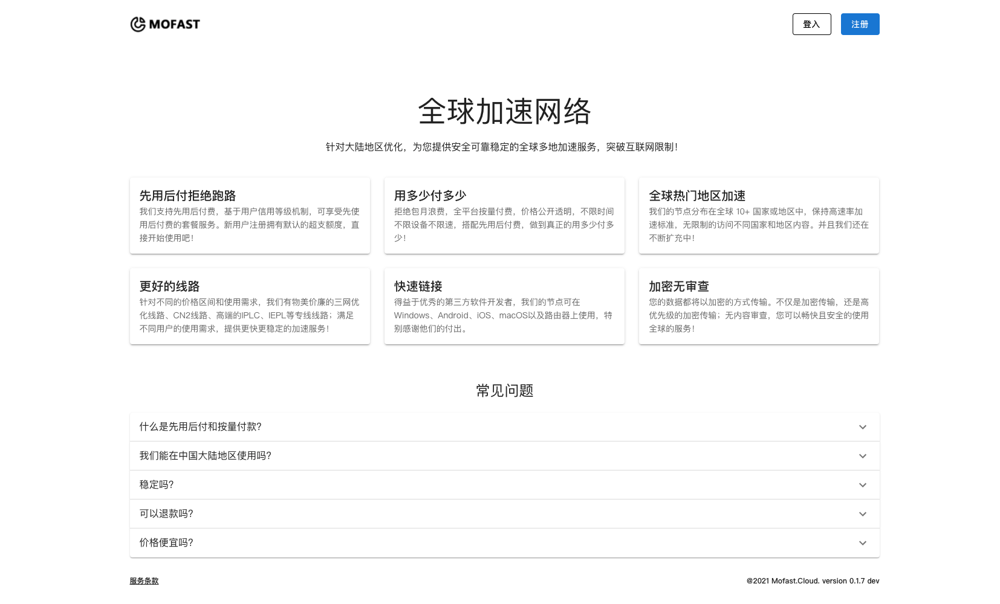

# v2board Mofast (仅首页)

```
免责声明:
此库仅本人个人学习开发并维护，不保证任何可用性，也不对使用本库主题造成的任何后果负责。
下载后请勿用于商业用途 ( 悠悠的 baby..🌹 Try it!!! )

喜欢🥰 就用你的小jiojio 点一个 ⭐️ Star ! thank you. ->
```

- [写代码很容易，写成一坨~😶‍🌫️.. 能用即可](https://github.com/trekhleb/state-of-the-art-shitcode)
- 如果并不合您,请自行用❤️发电！

### 温馨提示
```
请自行修改 源码内容（当前的简介,logo 等信息都是copy人家的,小心揍你🔨~）

修改完毕,按照下方步骤打包📦
```

### 源文件必要修改项
[Tab栏图标](index.html#L7)
[页面标题](index.html#L13)
[导航Logo](src/Home.tsx#L46)
[登入跳转链接](src/Home.tsx#L51)
[注册跳转链接](src/Home.tsx#L59)
[底部构建信息](src/Home.tsx#L192)

<details>
<summary> 展开查看页面预览</summary>


</details>


## 如何使用它?
### 安装 node 环境

[node.js 官网](https://nodejs.org/) 

### 使用 yarn
```shell
# 安装yarn
npm install -g yarn

# 进入工作目录
cd v2board-home-Mofast

# 安装依赖包
yarn install

# 编译打包
yarn build
```
- 等待打包..... 很快的 尤大的 vite～ 🥰

```
膜法班 ～ biu🥳 多了一个 dist 文件夹

目录结构
dist
  ├── assets
  │     └── index.[hash].js
  │     └── index.[hash].css
  │     └── vendor.[hash].js
  └── index.html
  
到这里你就完成了你的项目构建～
```
### 部署
上传到服务器,创建一个web站点 解析子域名 符合审美的方式

🪵都会了...！  你废了吗? 🥶